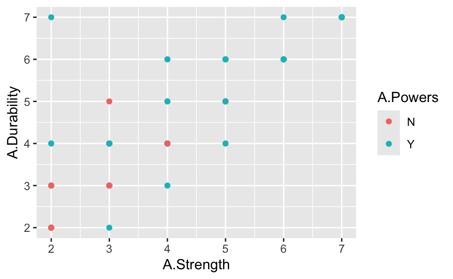
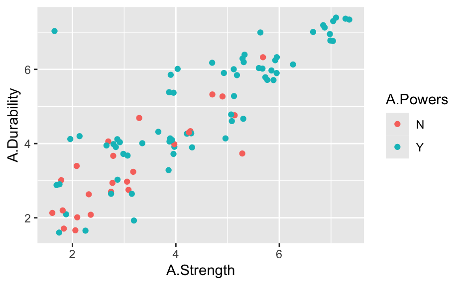

# **Personal Avengers Power Grid**

## **Introduction**

For this personal dataset project I decided to explore every offcial Avenger from the Marvel Universe. The intial data comes from comic vine.
I collected the data by reviewing character profiles and story summaries, paying special attention to descriptive keywords such as genius, superhuman, 
fast, enhanced, and similar terms that indicate a character’s abilities. These keywords helped identify which attributes a character possessed. I then examined specific 
feats mentioned in their histories to gauge the scale of those abilities. Using this information, I assigned numerical values to categories like speed, intelligence, strength, 
combat skills, and durability to create consistent power-level ratings across all characters.

## **Data Processing**

In order to carry out the analysis, I trimmed the categorical columns to remove the extra space after each letter so that the outputs were standardized to only ‘Y’ or ‘N’. 
I also calculated the average score for each character.

## **Exploratory Analysis**

After identifying two columns that appeared to have a relationship, I created a scatter plot to explore this further. The variables selected were Durability and Strength, since higher durability typically requires greater strength. The plot below displays the scatter relationship between these two attributes.

In my first graph, I used geom_point(), which produced what appeared to be a roughly linear relationship between Strength and Durability. However, I quickly noticed that many data points were overlapping. To address this, I created a second plot using geom_jitter(), which spreads the points slightly and allows all observations to be seen clearly.
From the jittered plot, I observed that Avengers with high Durability and high Strength almost always possess powers. There is one notable exception: a non-powered Avenger who shows unusually high Durability and Strength, standing out from the general pattern.
I also identified an outlier. A powered Avenger with very low Strength and Durability. This could be due to several factors: their abilities may not be physical (e.g., magic, technology, intellect, or energy-based powers), their power classification may come from a non-combat skill, or they may have powers that don’t contribute to physical stats. This explains why their durability and strength scores are low despite being labeled as powered.

## **Linear Model**

I created a linear regression model after observing a linear relationship between Durability and Strength. The model produced an R-squared value of 0.7583. This value indicates
that approximately 75.83% of the variation in Durability can be explained by Strength. In other words, there is a strong positive relationship between these two attributes, although about 24% of the variation is due to other factors not captured by this model.

